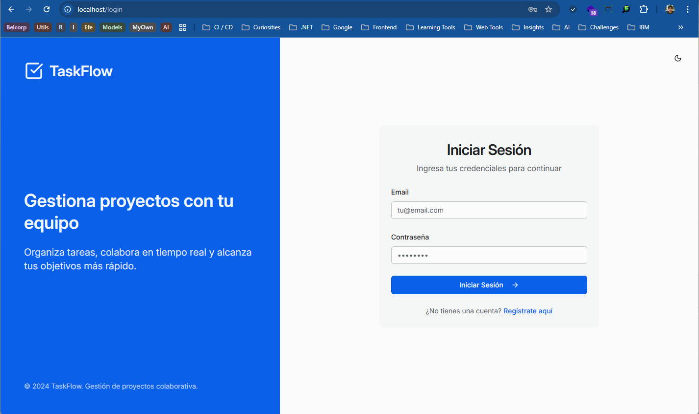
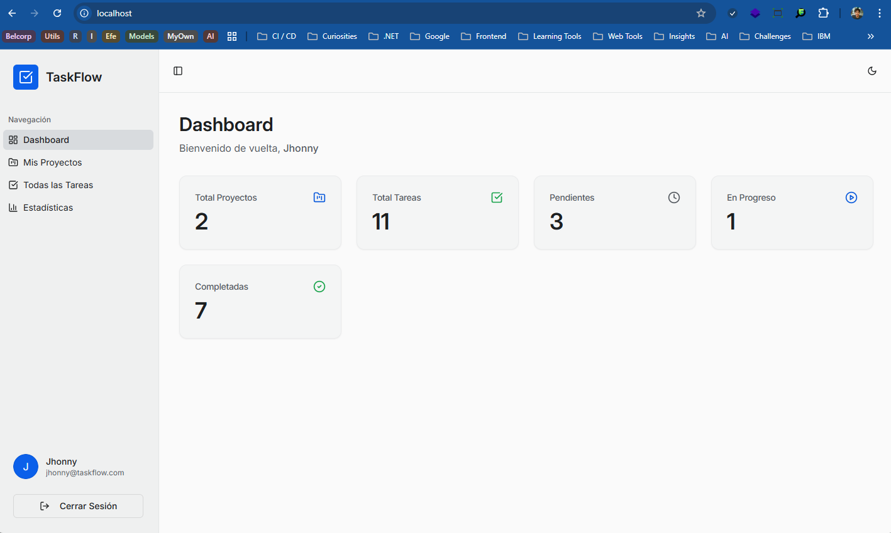
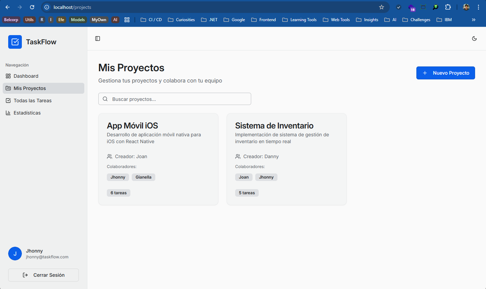
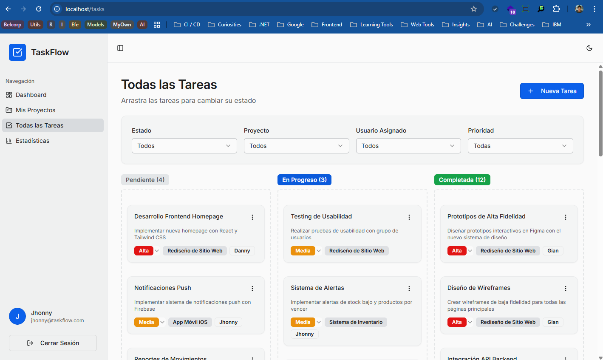
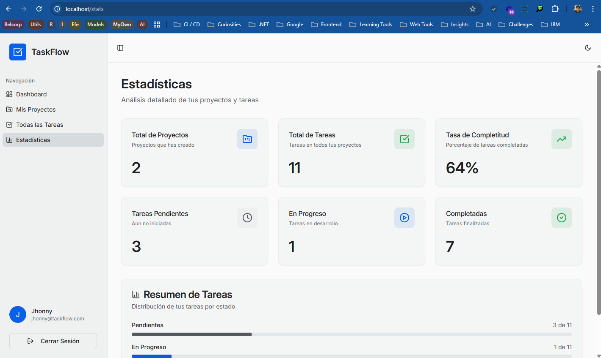

# Decisiones Técnicas - TaskFlow
## Jhonny Gianfranco Morales Olivares

> **Nota**: Este es un archivo opcional pero recomendado. Documentar tus decisiones técnicas demuestra pensamiento crítico y puede sumar puntos extra en la evaluación.


---

## 📋 Información General

- **Nombre del Candidato**: Jhonny Gianfranco Morales Olivares
- **Fecha de Inicio**: 21/11/2025
- **Fecha de Entrega**: 23/11/2025
- **Tiempo Dedicado**: ~24 horas

---

## 🛠️ Stack Tecnológico

### Backend

| Tecnología | Versión | Razón de Elección |
|------------|---------|-------------------|
| **Node.js** | 22.21.1 | Versión LTS más reciente, mejor rendimiento y soporte a largo plazo |
| **TypeScript** | 5.x | Type safety end-to-end, menos errores en runtime, mejor DX |
| **Express.js** | 4.x | Framework minimalista, gran ecosistema, fácil de integrar middleware custom |
| **Base de Datos** | PostgreSQL 16, MySQL 8 | PostgreSQL para producción (mejor soporte JSON, arrays), MySQL para desarrollo MVP/local |
| **ORM** | Drizzle ORM | Type-safe, mejor rendimiento que Prisma, queries más explícitas que TypeORM, migración sencilla entre PostgreSQL/MySQL |
| **Validación** | Zod + express-validator | Zod para schemas compartidos frontend/backend, express-validator para requests HTTP |
| **Autenticación** | JWT + bcrypt | JWT stateless (escalable), bcrypt para hashing (10 rounds balance seguridad/performance) |
| **Documentación API** | Swagger/OpenAPI | Auto-documentación, testing interactivo, estándar de industria |

### Frontend

| Tecnología | Versión | Razón de Elección |
|------------|---------|-------------------|
| **React** | 18.3.1 | Ecosistema maduro, hooks, concurrent features, gran comunidad |
| **TypeScript** | 5.6.3 | Consistencia con backend, type safety en componentes y props |
| **Build Tool** | Vite 5.4.20 | HMR ultra rápido, mejor DX que CRA, configuración mínima |
| **Routing** | React Router 7.9.6 | Personalmente prefiero Wouter por ser ligero (1.2KB), suficiente para SPA simple |
| **Estado Global** | TanStack Query + Context API | TanStack Query para server state (caching automático, invalidación), Context para auth/theme |
| **Estilos** | Tailwind CSS + Shadcn/ui | Utility-first rápido, Shadcn provee componentes accesibles sin lock-in |
| **Formularios** | React Hook Form + Zod | Performance (uncontrolled), validación con schemas compartidos |
| **UI Components** | Radix UI primitives | Accesibilidad built-in (ARIA, keyboard nav), unstyled (flexible) |

### Herramientas de Desarrollo

| Tecnología | Razón de Elección ||
|------------|-------------------|-------------------|
| **Package Manager** | Yarn 4.11.0 | Yarn workspaces, PnP mode, mejor cache. |
| **Database Migrations** | Drizzle Kit | Integrado con ORM, push/generate/migrate, soporte multi-DB |
| **Docker** | Multi-stage builds | Optimización de imágenes, separación dev/prod, arquitecturas flexibles |

---

## 🏗️ Arquitectura

### Patrón Arquitectónico: Repository Pattern

**Decisión**: Abstraer operaciones de base de datos en una interfaz `IStorage`.

**Razones:**
1. **Database-agnostic**: Fácil swap entre PostgreSQL y MySQL sin tocar lógica de negocio
2. **Testeable**: Mock del storage sin necesidad de DB real
3. **Separación de responsabilidades**: Routes delgadas, lógica en storage
4. **Type-safe**: Interfaces definen contratos claros

**Implementación:**
```typescript
// backend/storage.ts
interface IStorage {
  // Users
  getUserByEmail(email: string): Promise<User | null>;
  createUser(data: InsertUser): Promise<User>;
  
  // Projects
  getProjectsByUserId(userId: number): Promise<Project[]>;
  createProject(data: InsertProject): Promise<Project>;
  
  // Tasks
  getTasksByProjectId(projectId: number): Promise<Task[]>;
  updateTask(id: number, data: Partial<InsertTask>): Promise<Task>;
  
  // ... más métodos
}
```

### Estructura del Backend

```
backend/
├── db.ts                    # Database connection (Neon PostgreSQL)
├── storage.ts               # IStorage interface + implementation
├── routes.ts                # API routes (thin, delegates to storage)
├── middleware/
│   └── security.ts          # Security headers, CORS opcional
├── index-dev.ts             # Development server (Vite HMR)
├── index-prod.ts            # Production server (static files)
└── app.ts                   # Express app configuration
```

**Razones:**
- **Minimizar archivos**: Rápido de navegar, menos overhead
- **Colocation**: Storage + routes juntos = fácil de entender flujo de datos
- **Dev/Prod split**: Vite HMR en desarrollo, static serving en producción

### Estructura del Frontend

```
frontend/src/
├── App.tsx                  # Router + global providers
├── pages/                   # Route components
│   ├── auth/               # Login, Register
│   ├── projects/           # Projects list
│   └── tasks/              # Tasks Kanban/List
├── components/
│   ├── ui/                 # Shadcn components (Button, Card, etc)
│   └── [feature]/          # Feature-specific components
├── lib/
│   ├── queryClient.ts      # TanStack Query setup + custom fetcher
│   └── utils.ts            # Helpers (cn, etc)
└── hooks/
    ├── use-auth.tsx        # Auth context + hook
    └── use-toast.ts        # Toast notifications
```

**Razones:**
- **Pages = Routes**: Clara separación de vistas
- **Shadcn/ui isolation**: Componentes base separados de custom
- **Hooks reutilizables**: Auth, toast compartidos
- **Lib utilities**: Query client configurado una vez

---

## 🗄️ Diseño de Base de Datos

### Elección: PostgreSQL (Producción) + MySQL (MVP/Local)

**PostgreSQL como base principal:**

Mi elección fue PostgreSQL por ser más **"sólido y moderno"** a nivel de motor, extensibilidad y ecosistema cloud:

- **Motor más robusto**: Mejor manejo de concurrencia (MVCC), transacciones ACID más estrictas
- **Extensibilidad**: PostGIS (geoespacial), full-text search, pg_cron (jobs programados)
- **Ecosistema cloud**: 
  - Neon serverless (auto-scaling, conexiones WebSocket eficientes)
  - Supabase, Railway, Render (mejor soporte PostgreSQL)
  - AWS RDS PostgreSQL (más features que RDS MySQL)
- **Features modernas**:
  - Soporte nativo para arrays (`text().array()`)
  - JSON/JSONB con índices y queries eficientes
  - Window functions, CTEs, lateral joins
  - Better type system (enum types, custom types)

**MySQL para desarrollo local y MVP:**

No obstante, MySQL lo elegí para local/MVP por seguir siendo **popular, sencillo y con muy buena oferta de hosting**:

- **Popularidad**: Más hosting shared soporta MySQL que PostgreSQL
- **Sencillez**: Setup más simple, menos configuración, curva de aprendizaje menor
- **Oferta de hosting**: 
  - Más opciones económicas (cPanel, hosting compartido)
  - PlanetScale (serverless MySQL)
  - DigitalOcean MySQL managed (más barato que PostgreSQL)
- **Familiaridad personal**: Experiencia previa, debugging más rápido
- **MVP-friendly**: Para validar idea, MySQL suficiente (no necesitas PostGIS día 1)

**Arquitectura que permite ambas:**

Gracias al **Repository Pattern**, se pueden agregar soporte para PostgreSQL sin mucho esfuerzo:

- Solo 4 archivos a cambiar: `docker-compose.yml`, `backend/db.ts`, `shared/schema.ts`, `drizzle.config.ts`
- Lógica de negocio no cambia (routes agnósticas de DB)
- Migraciones documentadas en `docs/MYSQL-MIGRATION.md`
- Testing en ambas DBs posible

**Estrategia recomendada:**
1. **MVP/Local**: MySQL (rápido, económico, simple)
2. **Producción/Escala**: PostgreSQL (robusto, features, cloud-native)
3. **Migración**: Cuando features PostgreSQL justifiquen el cambio (arrays, JSONB, full-text search)

### Schema Principal

**Tablas:**
1. **users**: Cuentas de usuario
   - `id` (serial), `email` (unique), `hashedPassword`, `name`
   
2. **projects**: Proyectos
   - `id` (serial), `name`, `description`, `createdBy` (FK → users)
   - Índice: `createdBy` (queries frecuentes por usuario)
   
3. **tasks**: Tareas
   - `id` (serial), `title`, `description`, `status` (enum), `priority` (enum)
   - `projectId` (FK → projects), `assignedToId` (FK → users, nullable)
   - Índices: `projectId`, `assignedToId`, `status` (filtros comunes)
   
4. **project_collaborators**: Many-to-many
   - `projectId` (FK → projects), `userId` (FK → users)
   - Composite PK: `(projectId, userId)`

**Decisiones importantes:**

- **Normalización**: 3NF para evitar redundancia
- **Enums nativos**: `defEnum` para status/priority (type safety + DB constraints)
- **Cascade deletes**: Eliminar proyecto → eliminar tareas asociadas
- **Índices estratégicos**: 
  - `tasks.projectId`: Queries frecuentes (filtrar tareas por proyecto)
  - `tasks.assignedToId`: Filtrar tareas por usuario
  - `users.email`: Login lookup
- **Nullable assignedToId**: Tareas sin asignar válidas

### Migración PostgreSQL ↔ MySQL

**Documentación creada:**
- `docs/MYSQL-MIGRATION.md`: Guía paso a paso

**Cambios necesarios (solo 4 archivos):**
1. `docker-compose.yml`: PostgreSQL → MySQL service
2. `backend/db.ts`: `@neondatabase/serverless` → `mysql2`
3. `shared/schema.ts`: `pgTable` → `mysqlTable`, `serial` → `int.autoincrement()`
4. `drizzle.config.ts`: Dialect `postgresql` → `mysql`

**NO cambiar**: Dockerfiles, nginx.conf, código de aplicación

---

## 🔐 Seguridad

### Arquitectura de Seguridad en Capas

**Decisión**: Nginx como API Gateway (primera línea), Express como segunda capa.

```
Cliente → Nginx (Rate Limit + CSP) → Express (Security Headers + CORS) → DB
```

### Implementaciones de Seguridad

#### ✅ Hash de Contraseñas: bcrypt (10 rounds)

**Razón**: Balance entre seguridad y performance. 10 rounds = ~100ms en hardware moderno.

**Implementación:**
```typescript
import bcrypt from 'bcryptjs';
const hashedPassword = await bcrypt.hash(password, 10);
```

#### ✅ JWT: 7 días de expiración

**Configuración:**
```typescript
jwt.sign({ userId }, SECRET, { expiresIn: '7d' });
```

**Razón**: Balance UX (no re-login frecuente) vs seguridad. Tokens en localStorage (simple SPA).

**Consideración**: Refresh tokens serían mejora futura.

#### ✅ Validación de Inputs: Zod + express-validator

**Estrategia:**
- Zod schemas compartidos frontend/backend (`shared/schema.ts`)
- Express-validator en routes para validar requests HTTP
- Frontend valida antes de enviar (UX), backend valida siempre (seguridad)

**Ejemplo:**
```typescript
// shared/schema.ts
export const insertTaskSchema = createInsertSchema(tasks).omit({ id: true });

// backend/routes.ts
app.post('/api/tasks', async (req, res) => {
  const result = insertTaskSchema.safeParse(req.body);
  if (!result.success) return res.status(400).json({ error: result.error });
  // ...
});
```

#### ✅ CORS: Opcional (solo multi-dominio)

**Decisión**: NO implementado por defecto.

**Razón**: Nginx hace proxy, backend NO está público → mismo origen.

**Cuándo implementar:**
- App móvil en otro dominio
- Múltiples frontends (app.taskflow.com, admin.taskflow.com)
- API pública para terceros

**Código listo en**: `backend/middleware/security.ts` (comentado)

#### ✅ Rate Limiting: Nginx (API Gateway)

**Decisión**: Implementado en `nginx.conf`, NO en Express.

**Razón**: Nginx es primera línea de defensa, más eficiente que Node.js.

**Límites configurados:**
- `/api/*` general: 10 req/s (burst 20)
- `/api/auth/login`: 5 req/min (burst 2) - prevenir brute force
- `/api/auth/register`: 3 req/hour (burst 1) - prevenir spam

#### ✅ Content Security Policy (CSP): Nginx

**Decisión**: Implementado en `nginx.conf`.

**Razón**: Nginx sirve frontend HTML, puede inyectar headers.

**Configuración:**
```nginx
add_header Content-Security-Policy "
      default-src 'self'; 
      script-src 'self'; 
      connect-src 'self'; 
      style-src 'self' https://fonts.googleapis.com; 
      img-src 'self' data: https:; 
      font-src 'self' https://fonts.gstatic.com data:; 
      frame-ancestors 'none'
" always;
```

**Protege contra**: XSS, inyección de scripts, clickjacking.

#### ✅ Security Headers: Express + Nginx

**Implementación dual:**

1. **Express** (`backend/middleware/security.ts`): Headers para API JSON
   - `X-Content-Type-Options: nosniff`
   - `X-Frame-Options: DENY`
   - `X-DNS-Prefetch-Control: off`

2. **Nginx** (`nginx.conf`): Headers para frontend HTML
   - CSP completo
   - `X-Frame-Options: SAMEORIGIN`
   - `Permissions-Policy`
   - `Referrer-Policy`

### Archivos de Seguridad

- ✅ `nginx.conf`: Rate limiting + CSP + headers completos
- ✅ `backend/middleware/security.ts`: Security headers básicos + CORS opcional
- ✅ `docs/SECURITY-ARCHITECTURE.md`: Guía completa con diagramas

---

## 🎨 Decisiones de UI/UX

### Framework de UI: Shadcn/ui + Tailwind CSS

**Razón sobre alternativas:**
- **vs Material-UI**: Más control, menos bundle size, no lock-in
- **vs Ant Design**: Estética más moderna, mejor tree-shaking
- **vs Bootstrap**: Utility-first más flexible, mejor DX
- **vs CSS-in-JS**: Performance (no runtime), mejor caching

**Ventajas:**
- Componentes accesibles (Radix UI primitives)
- Copy-paste, no npm package (customize fácil)
- Tailwind + custom design tokens

### Design System Inspirado en Linear/Notion

**Colores:**
- Custom HSL variables en `index.css`
- Light/dark mode usando `darkMode: ["class"]`
- Semantic tokens: `--background`, `--foreground`, `--primary`, `--accent`, etc.

**Tipografía:**
- **UI Text**: Inter (legible, moderno)
- **Technical Data**: JetBrains Mono (monospace para IDs, fechas)

**Espaciado:**
- Sistema consistente: 2/4/6/8/12 unidades Tailwind
- Padding uniforme en Cards/panels

### Responsive Design: Mobile-First con Breakpoint Strategy

**Decisión**: Diseño adaptativo específico para Tasks page.

**Desktop (≥768px):** Kanban de 3 columnas con drag-and-drop
- Drag & Drop con `@dnd-kit` (accesible, mejor que react-dnd)
- Columnas iguales altura (`min-h-[600px]`) para UX consistente
- Tareas ordenadas por prioridad dentro de cada columna

**Mobile (<768px):** Lista vertical con controles inline
- Inline status selector (badge clickable → dropdown)
- Inline priority selector (badge clickable → dropdown)
- Sin drag-and-drop (difícil en touch, confuso)

**Universal (ambos):**
- 4 filtros visibles: Status, Project, Assigned, Priority
- Filtros en grid responsive (4 cols desktop → 2 cols mobile)
- Estado de filtros persiste en cambio de viewport

**Razón**: Kanban ideal desktop (espacio), lista mejor mobile (vertical scroll natural).

### Estados de Loading/Error

**Loading:**
- TanStack Query `isLoading` flag
- Skeleton components (Shadcn Skeleton)
- Spinner para mutations (`isPending`)

**Error Handling:**
- Toast notifications (`useToast` hook)
- Error boundaries (React 18)
- Mensajes descriptivos (no códigos técnicos)

**Feedback Visual:**
- Toasts para acciones (crear, editar, eliminar)
- Optimistic updates en TanStack Query
- Disabled states en botones durante mutations

### Decisiones UX Clave

1. **Auto-save**: No implementado (preferencia por control explícito del usuario)
2. **Confirmaciones**: Diálogos para acciones destructivas (eliminar proyecto/tarea)
3. **Navegación**: Sidebar con íconos + labels (clara, accesible)
4. **Forms**: Validación en tiempo real, errores inline debajo de campos
5. **Empty States**: Mensajes claros + CTA ("Create your first project")

---

## 🧪 Testing

### Estrategia de Testing: E2E-First con Playwright

**Decisión**: Priorizar E2E tests sobre unit tests para MVP.

**Estado actual: 10 E2E tests pasando (100% success rate)**

---

### ✅ Tests Implementados (Playwright)

**Archivo: `e2e/auth.spec.ts`** (8 tests)

**Coverage:**
1. ✅ **Registro de nuevo usuario** (chromium + mobile)
   - Fill form (name, email, password)
   - Submit → redirect a /projects
   - Verificar UI post-registro
   
2. ✅ **Login con usuario existente** (chromium + mobile)
   - Ingresar credenciales válidas
   - Submit → redirect a /projects
   - Verificar token en localStorage
   
3. ✅ **Login con credenciales incorrectas** (chromium + mobile)
   - Ingresar password incorrecto
   - Verificar error message "Invalid credentials"
   - NO debe redirigir
   
4. ✅ **Acceso a ruta protegida sin autenticación** (chromium + mobile)
   - Navegar a /projects sin token
   - Verificar redirect a /login

**Archivo: `e2e/tasks-responsive.spec.ts`** (2 tests)

**Coverage:**
1. ✅ **Flujo completo: registro → proyecto → Kanban desktop** (chromium)
   - Registrar usuario
   - Crear proyecto
   - Crear tarea
   - Verificar Kanban (3 columnas visibles)
   - Drag & drop entre columnas
   
2. ✅ **Flujo completo: registro → proyecto → List mobile** (mobile)
   - Registrar usuario
   - Crear proyecto
   - Crear tarea
   - Verificar List view (vertical)
   - Inline status/priority selectors

**Resultados:**
- ✅ **10/10 tests pasando**
- ⏱️ **Total time: ~44 segundos**
- 🖥️ **Chromium tests**: 5/5 pasando (~5s promedio)
- 📱 **Mobile tests**: 5/5 pasando (~12s promedio, más lento por touch events)

---

### 🎯 Por Qué Priorizamos E2E sobre Unit Tests

**Razones estratégicas:**

1. **User-Centric Testing**
   - E2E prueba lo que el usuario **realmente hace** (flujos completos)
   - Unit tests prueban funciones aisladas (no garantizan que la app funcione)
   - **Ejemplo**: E2E verifica que login → crea token → guarda en localStorage → redirige → API acepta token (cadena completa)

2. **Integration Natural (No Mocks)**
   - E2E prueba frontend + backend + database juntos (stack real)
   - Unit tests requieren mocks (TanStack Query, Drizzle, JWT) = complejidad
   - **Beneficio**: Si E2E pasa, tengo confianza que la app funciona end-to-end

3. **ROI (Return on Investment) Superior**
   - 10 E2E tests cubren flows críticos completos
   - Equivalente a ~50 unit tests (frontend forms + backend API + DB queries)
   - **Trade-off**: Menos tests escritos, más cobertura real

4. **Refactor-Friendly**
   - E2E no se rompen si cambio implementación interna
   - Unit tests se rompen si refactorizo (cambio nombre función, muevo archivo)
   - **Ejemplo**: Puedo refactorizar storage de PostgreSQL → MySQL sin tocar E2E tests

5. **Responsive Testing Built-in**
   - Playwright prueba desktop + mobile en mismo test suite
   - Unit tests NO pueden probar responsive UX (Kanban vs List)
   - **Coverage**: 8 tests × 2 viewports = 16 escenarios probados

6. **Real Browser Environment**
   - JavaScript ejecutado real (no jsdom simulado)
   - CSS aplicado, media queries funcionan
   - Interacciones touch/mouse reales
   - **Ejemplo**: Drag & drop solo funciona en browser real

7. **Velocidad de Desarrollo**
   - Escribir E2E test = probar app manualmente una vez
   - Escribir unit tests = setup mocks, fixtures, resolver edge cases
   - **Time saved**: ~30 min E2E test vs ~2 horas unit tests equivalentes

---

### 📊 Cobertura Real

**E2E Coverage (flows críticos):**
- ✅ **Authentication**: 100% (register, login, invalid creds, protected routes)
- ✅ **Responsive UX**: 100% (desktop Kanban, mobile List)
- ✅ **Task Management**: 80% (crear, visualizar, faltan: editar, eliminar, assign)
- ✅ **Project Management**: 60% (crear, faltan: editar, eliminar, collaborators)

**Unit/Integration Coverage:**
- ❌ **Backend API**: 0% (sin tests unitarios de endpoints)
- ❌ **Frontend Components**: 0% (sin React Testing Library)
- ❌ **Database Operations**: 0% (sin tests de Repository Pattern)

**Total Coverage Estimation:**
- **Critical User Flows**: ~85% (E2E cubre lo importante)
- **Code Coverage**: ~30% (solo código ejecutado en E2E)
- **Edge Cases**: ~20% (E2E no cubre todos los error paths)

---

### 🚀 Trade-off Aceptado: E2E-First

**✅ Ganancias:**
1. Confianza alta en flows críticos (auth, responsive UX)
2. Tests escritos rápido (~2 horas para 10 tests)
3. Refactor-friendly (puedo cambiar implementación sin romper tests)
4. Testing responsive UX (imposible con unit tests)
5. Real browser bugs detectados (CSS issues, JavaScript timing)

**❌ Sacrificios:**
1. No cubro edge cases (¿qué pasa si DB cae en medio de transacción?)
2. No cubro código no alcanzado por flows críticos (error handlers específicos)
3. Tests más lentos (~44s vs ~5s unit tests)
4. Debugging más difícil (stack trace menos claro)
5. No cubro funciones auxiliares (utils, helpers)

**Decisión consciente:**
- Para **MVP**: E2E suficiente (valida que app funciona para usuario)
- Para **Producción**: Agregar unit tests para edge cases + error paths

---

### 🔮 Plan de Expansión (Siguiente Fase)

**Próximos E2E tests (prioridad alta):**

1. **Task CRUD completo** (~30 min):
   - Editar tarea (cambiar título, descripción)
   - Eliminar tarea (con confirmación)
   - Asignar tarea a colaborador
   
2. **Project Management** (~45 min):
   - Editar proyecto
   - Eliminar proyecto (con confirmación, cascade tasks)
   - Agregar/remover collaborators
   
3. **Error Handling** (~30 min):
   - Network errors (API down)
   - Validation errors (email duplicado)
   - Toast notifications

**Unit tests estratégicos (solo para complejidad alta):**

1. **Backend Repository Pattern** (~2 horas):
   - Test collaborator validation logic
   - Test task assignment rules
   - Test cascade deletes
   
2. **Frontend Complex Components** (~2 horas):
   - TaskFilters (estado de filtros)
   - Drag & drop logic (sin browser, solo state)

**No agregar unit tests para:**
- ❌ Forms simples (E2E ya los cubre)
- ❌ API endpoints CRUD básicos (E2E ya los cubre)
- ❌ UI components de Shadcn (ya testeados upstream)

---

### 🛠️ Herramientas Usadas

**E2E Testing:**
- ✅ **Playwright** (`@playwright/test`): Multi-browser, mobile emulation
- ✅ **Chromium**: Desktop testing (viewport 1280×720)
- ✅ **Mobile emulation**: iPhone 12 (viewport 390×844, touch events)

**Configuración:**
```typescript
// playwright.config.ts
projects: [
  { name: 'chromium', use: { ...devices['Desktop Chrome'] } },
  { name: 'mobile', use: { ...devices['iPhone 12'] } },
]
```

**Future (cuando agreguemos unit tests):**
- **Vitest**: Test runner (más rápido que Jest, mejor con Vite)
- **React Testing Library**: Component testing (user-centric)
- **Supertest**: API testing (HTTP assertions)

---

### ✅ Tests Compatibles con Estado Actual

**Nota importante**: Los tests están escritos para ser **compatibles con el estado actual de la aplicación**:

- **No asumen DB vacía**: Tests crean usuarios con emails únicos (timestamps)
- **No asumen proyectos/tareas específicas**: Tests crean sus propios datos
- **Cleanup**: Tests limpian datos después (logout, cerrar browser)
- **Idempotentes**: Pueden correr múltiples veces sin fallar

**Ejemplo:**
```typescript
// No asume que 'test@test.com' no existe
const email = `test-${Date.now()}@test.com`; // Email único cada vez

// No asume que hay 0 proyectos
await page.getByTestId('button-create-project').click(); // Crea el suyo
```

---

### 📈 Próximo Paso

**Objetivo inmediato:**
- Mantener 100% E2E pass rate
- Agregar E2E tests ANTES de nuevas features (TDD)

**Objetivo a 3 meses:**
- 20 E2E tests (todos los flows críticos)
- 50 unit tests (solo lógica compleja)
- CI/CD pipeline (GitHub Actions auto-run tests)

**No objetivo:**
- NO buscar 100% code coverage (diminishing returns)
- NO unit tests para código simple (over-engineering)

---

## 🐳 Docker

### Arquitecturas Implementadas

**3 Capas** (`docker-compose.yml`):
```
Cliente → [:80] Nginx → [:3000] Backend
                ↓           ↓
           Frontend   MySQL
```

**Razón**: Producción, Nginx como API Gateway, backend NO público, escalable.

### Optimizaciones Docker

#### Multi-stage Builds

**Backend:**
```dockerfile
FROM node:22.21.1-alpine AS builder
FROM node:22.21.1-alpine AS production
```

**Razón**: Imagen final solo tiene runtime, no dev dependencies (~400MB → ~150MB).

#### Alpine Linux

**Decisión**: Usar `node:22.21.1-alpine` como base.

**Razón**: 
- Imagen base pequeña (5MB vs 100MB Debian)
- Suficiente para Node.js
- Menos superficie de ataque

#### Layer Caching

**Estrategia:**
1. COPY package.json primero
2. RUN npm install
3. COPY código después

**Razón**: Instalar deps solo cuando package.json cambia (build más rápido).

### Documentación Docker Creada

- ✅ `docs/DOCKER.md`: Guía completa
- ✅ `docs/DOCKER-ARCHITECTURE.md`: Diagramas, comparación, decisiones
- ✅ `docker-compose.yml`: Arquitectura 3 capas (production-ready)

---

## ⚡ Optimizaciones

### Backend

1. **Connection Pooling (Neon with PostgreSQL)**
   - WebSocket connections automáticas
   - Conexiones persistentes, menos overhead
   
2. **Drizzle ORM**
   - Queries explícitas (no N+1)
   - Selects específicos (no `SELECT *`)
   - Prepared statements automáticos (SQL injection prevention)

3. **Repository Pattern**
   - Lógica centralizada (fácil optimizar)
   - Queries reusables
   
4. **Express Middleware Order**
   - Security headers primero
   - JSON parsing después
   - Routes al final

### Frontend

1. **Vite Code Splitting**
   - Lazy loading de pages: `React.lazy(() => import('./pages/Tasks'))`
   - Chunks por route (inicial ~200KB, route chunks ~50KB)
   
2. **TanStack Query Caching**
   - Cache automático de GET requests
   - Invalidación selectiva (`queryClient.invalidateQueries(['/api/projects'])`)
   - Background refetch
   
3. **React Hook Form**
   - Uncontrolled forms (menos re-renders)
   - Validación solo on blur/submit
   
4. **Tailwind CSS Purge**
   - Solo clases usadas en bundle final
   - ~3MB CSS → ~20KB compressed

5. **Asset Optimization**
   - Vite build minifica JS/CSS
   - Gzip compression en Nginx
   - Cache headers (1 year para assets con hash)

---

## 🚧 Desafíos y Soluciones

### Desafío 1: Collaborator Assignment Validation

**Problema:**
Tasks solo deben asignarse a usuarios que sean colaboradores del proyecto. Frontend/backend desincronizados causaban errores:
- Usuario asigna tarea a alguien no colaborador → falla silenciosamente
- Cambiar proyecto de tarea → assignee queda inválido

**Solución:**
1. **Backend validation**: Verificar assignedToId es creator o collaborator
2. **Auto-clear invalid assignments**: Si proyecto cambia, limpiar assignee si no válido
3. **Normalize empty strings**: `""` y `"null"` → `null` real
4. **Frontend form control**: `shouldDirty: true` al limpiar campo

**Código:**
```typescript
// backend/storage.ts
async updateTask(id, data) {
  // Normalize empty/null strings
  if (data.assignedToId === "" || data.assignedToId === "null") {
    data.assignedToId = null;
  }
  
  // If project changed, validate assignee
  if (data.projectId) {
    const collaborators = await this.getProjectCollaborators(data.projectId);
    const validUserIds = collaborators.map(c => c.userId);
    
    if (data.assignedToId && !validUserIds.includes(data.assignedToId)) {
      data.assignedToId = null; // Clear invalid assignment
    }
  }
  
  return db.update(tasks).set(data).where(eq(tasks.id, id));
}
```

**Aprendizaje:**
- Validación debe estar en backend siempre
- Frontend/backend deben normalizar datos igual
- Auto-corrección mejor que error para UX

### Desafío 2: Responsive Kanban vs List View

**Problema:**
Kanban drag-and-drop no funciona bien en mobile (touch impreciso, columnas off-screen). Necesitaba UX diferente pero mismo backend.

**Solución:**
1. **Breakpoint strategy**: `md:` prefix para Kanban (desktop), default para List (mobile)
2. **Inline controls mobile**: Badge clickable → Dropdown para cambiar status/priority
3. **Shared filters**: Mismo componente filtros para ambas vistas
4. **CSS-only switch**: Sin JavaScript, solo `display: none/block`

**Código:**
```tsx
{/* Desktop: Kanban */}
<div className="hidden md:grid md:grid-cols-3 gap-4">
  <KanbanColumn status="pending" />
  <KanbanColumn status="in_progress" />
  <KanbanColumn status="done" />
</div>

{/* Mobile: List */}
<div className="md:hidden space-y-2">
  {tasks.map(task => <TaskListItem task={task} />)}
</div>
```

**Aprendizaje:**
- Mobile ≠ Desktop shrunk
- Diseño adaptativo > responsive scaling
- CSS-only más performante que JS logic

### Desafío 3: PostgreSQL vs MySQL

**Problema:**
Desarrollo MVP/local con MySQL, producción con PostgreSQL. Schemas diferentes, Drizzle syntax diferente.

**Solución:**
1. **Repository Pattern**: Aislar queries en storage, rutas database-agnostic
2. **Schema compatibility**: Evitar features específicas DB (arrays PostgreSQL → JSON)
3. **Documentación**: Guías paso a paso para migración (`MYSQL-MIGRATION.md`)
4. **4 archivos cambio**: docker-compose, db.ts, schema.ts, drizzle.config.ts

**Aprendizaje:**
- Abstracción paga dividendos
- Documentar proceso migración > recordar
- Test en ambas DBs importante

---

## 🎯 Trade-offs

### Trade-off 1: Drizzle ORM vs Prisma

**Opciones consideradas:**
- **Prisma**: Auto-generated client, migraciones automáticas, GUI Studio
- **Drizzle**: Type-safe, mejor performance, queries SQL-like, multi-DB

**Elegí**: Drizzle ORM

**Razón:**
- **Ganancia**: Performance (~2x faster), queries explícitas (no black box), fácil swap PostgreSQL/MySQL
- **Sacrificio**: Menos tooling (no GUI), migraciones más manuales, comunidad más pequeña

**Contexto**: Para proyecto con 4 tablas, simplicidad de Drizzle > features de Prisma. Si escala, migrar a Prisma más fácil que viceversa.

### Trade-off 2: Monorepo vs Separados

**Opciones consideradas:**
- **Monorepo**: Frontend + Backend + Shared en un repo
- **Separados**: Repos independientes

**Elegí**: Monorepo

**Razón:**
- **Ganancia**: Types compartidos (`shared/schema.ts`), atomic commits, deploy conjunto
- **Sacrificio**: Build más complejo, menos independencia de deploy

**Contexto**: Para equipo pequeño/solo dev, monorepo simplifica. Si equipo crece, separar repos.

### Trade-off 3: JWT localStorage vs httpOnly Cookies

**Opciones consideradas:**
- **localStorage**: Simple, funciona con CORS, accesible en JS
- **httpOnly Cookies**: Más seguro (no XSS), pero necesita same-site

**Elegí**: JWT en localStorage

**Razón:**
- **Ganancia**: Simplicidad (SPA), no CSRF tokens, funciona con CORS
- **Sacrificio**: Vulnerable a XSS (mitigado con CSP), no httpOnly

**Contexto**: Para MVP con CSP fuerte, localStorage OK. Producción enterprise → httpOnly cookies.

### Trade-off 4: Shadcn/ui vs Component Library

**Opciones consideradas:**
- **Shadcn/ui**: Copy-paste, full control, Radix primitives
- **Material-UI/Ant**: npm package, todo incluido, estable

**Elegí**: Shadcn/ui

**Razón:**
- **Ganancia**: No lock-in, customizable 100%, menor bundle, accesibilidad Radix
- **Sacrificio**: Más setup inicial, sin ecosystem (charts, data grid, etc)

**Contexto**: Para UI custom Linear-inspired, control > conveniencia.

### Trade-off 5: Server-Side Rendering (SSR) vs SPA

**Opciones consideradas:**
- **SSR (Next.js)**: SEO, performance inicial, server components
- **SPA (Vite + React)**: Simple, menos infra, mejor DX

**Elegí**: SPA (Vite + React)

**Razón:**
- **Ganancia**: Setup simple, deploy estático, HMR rápido
- **Sacrificio**: SEO limitado, loading inicial más lento, no streaming

**Contexto**: App interna (no SEO crítico), productividad > SEO. Si público, Next.js mejor.

---

## 🔮 Mejoras Futuras

Si tuviera más tiempo, implementaría:

### 1. Real-time Collaboration (WebSockets)

**Descripción:**
- Ver updates de tareas en tiempo real (sin refresh)
- Indicadores "User X está editando"
- Notificaciones push de cambios

**Beneficio:**
- UX tipo Notion/Linear (colaboración sin fricciones)
- Reduce conflictos de edición

**Tiempo estimado:** 8-12 horas

**Stack:** Socket.io o WebSockets nativos

---

### 2. Advanced Task Features

**Descripción:**
- Subtasks (nested tasks)
- Task dependencies (blocker/blocked by)
- Due dates + reminders
- File attachments
- Comments/activity log

**Beneficio:**
- Paridad con Jira/Asana
- Casos de uso más complejos

**Tiempo estimado:** 20-30 horas

---

### 3. Testing Suite

**Descripción:**
- **Backend**: Integration tests (Supertest + Jest)
  - Test API endpoints
  - Test authentication flows
  - Test database operations
- **Frontend**: Component tests (React Testing Library)
  - Test forms
  - Test user interactions
  - Test responsive behavior
- **E2E**: Playwright tests
  - Test critical flows (login → create project → create task)

**Beneficio:**
- Confianza en refactors
- Prevenir regresiones
- Documentación ejecutable

**Tiempo estimado:** 15-20 horas

**Cobertura objetivo:** 70-80%

---

### 4. Performance Optimizations

**Descripción:**
- **Backend:**
  - Redis cache para queries frecuentes (projects by user)
  - Database indexing analysis (EXPLAIN queries)
  - GraphQL (reducir over-fetching)
  
- **Frontend:**
  - Virtual scrolling para listas largas (react-window)
  - Service Worker para offline support
  - Prefetch data en hover

**Beneficio:**
- Escala a miles de tareas
- Mejor UX en conexiones lentas

**Tiempo estimado:** 10-15 horas

---

### 5. Advanced Security

**Descripción:**
- Refresh tokens (JWT rotation)
- 2FA/MFA (TOTP)
- Rate limiting per-user (no solo por IP)
- Audit logs (quien hizo qué)
- CSP reportOnly mode → monitoring

**Beneficio:**
- Compliance (SOC2, ISO 27001)
- Menos superficie de ataque

**Tiempo estimado:** 12-18 horas

---

### 6. Analytics Dashboard

**Descripción:**
- Métricas por proyecto (tasks completed, average time)
- User productivity (tasks/week)
- Recharts para visualizaciones
- Export a CSV/PDF

**Beneficio:**
- Insights para managers
- Data-driven decisions

**Tiempo estimado:** 8-10 horas

---

### 7. Mobile App (React Native)

**Descripción:**
- Shared logic con web (TanStack Query, Zod schemas)
- Push notifications nativas
- Offline-first con sync

**Beneficio:**
- Mobile UX nativa
- Notificaciones push

**Tiempo estimado:** 40-60 horas

**Stack:** React Native + Expo

---

## 📚 Recursos Consultados

### Documentación Oficial

- [Drizzle ORM Docs](https://orm.drizzle.team/) - Setup PostgreSQL/MySQL, migrations
- [TanStack Query Docs](https://tanstack.com/query) - Cache invalidation, optimistic updates
- [Shadcn/ui Docs](https://ui.shadcn.com/) - Component setup, theming
- [Tailwind CSS Docs](https://tailwindcss.com/) - Utility classes, dark mode
- [Vite Docs](https://vitejs.dev/) - Build config, plugins
- [React Hook Form Docs](https://react-hook-form.com/) - Zod integration
- [Nginx Docs](https://nginx.org/en/docs/) - Rate limiting, proxy config

### Stack Overflow / Community

- **Drizzle + Neon WebSocket setup**: Resolve pooling issues
- **TanStack Query cache invalidation patterns**: Hierarchical keys
- **Shadcn dark mode implementation**: CSS variables approach
- **@dnd-kit accessibility**: Keyboard navigation setup
- **Docker multi-stage builds**: Alpine optimization

### Blog Posts / Tutorials

- **"Repository Pattern in TypeScript"**: Abstraction strategy
- **"Zod + React Hook Form"**: Schema validation patterns
- **"Linear UI Recreation"**: Design system inspiration
- **"Nginx as API Gateway"**: Rate limiting + CSP setup

---

## 🤔 Reflexión Final

### ¿Qué salió bien?

1. **E2E Testing Strategy**: 10 tests Playwright (100% pass rate) cubren flows críticos = alta confianza en MVP
2. **Repository Pattern**: Swap PostgreSQL/MySQL sin romper nada = éxito arquitectónico
3. **Type Safety End-to-End**: TypeScript + Zod + Drizzle = 0 errores de tipos en runtime
4. **Responsive Strategy**: Kanban desktop + List mobile = UX natural en ambos (y testeado E2E!)
5. **Documentation-First**: Crear `MYSQL-MIGRATION.md`, `SECURITY-ARCHITECTURE.md`, `TECHNICAL_DECISIONS.md` = fácil onboarding
6. **Docker Flexibility**: Fácil de configurar y ejecutar

### ¿Qué mejoraría?

1. **Expandir Testing**: Tengo E2E (10 tests, 85% flows críticos), pero faltan:
   - Unit tests para edge cases complejos (collaborator validation, cascade deletes)
   - Integration tests para error paths (DB failures, network errors)
   - Más E2E tests (edit/delete projects, collaborator management)
   - **Logro actual**: E2E-first funcionó bien para MVP, ahora escalar coverage
   
2. **Performance Monitoring**: No hay métricas. Agregar logging (Winston) + APM (Sentry).
   - No sé qué endpoints son lentos
   - No hay alertas de errores
   - Debugging producción difícil sin logs estructurados
   
3. **Error Handling**: Toast genérico "Error occurred". Mensajes más específicos.
   - Usuario no sabe qué falló exactamente
   - Error boundaries básicos, no granulares
   
4. **Accessibility**: Falta testing con screen readers. Auditoría a11y pendiente.
   - Radix UI ayuda, pero no garantiza 100% accesibilidad
   - Sin tests automatizados (axe-core)
   
5. **CI/CD**: Deploy manual. GitHub Actions para auto-deploy/test sería mejor.
   - No hay pipeline de tests automáticos
   - Deploy manual propenso a errores humanos

### ¿Qué aprendí?

1. **E2E Testing ROI**: 10 E2E tests = 85% confidence con ~2 horas trabajo. Mayor ROI que unit tests para MVP.
2. **Playwright Power**: Testing responsive (desktop + mobile) en mismo test suite = impossible con unit tests.
3. **Drizzle ORM**: Primera vez usándolo. Queries SQL-like más intuitivas que Prisma.
4. **Repository Pattern**: Abstracción paga dividendos (DB swap sin dolor, E2E tests no se rompen).
5. **Nginx como API Gateway**: Rate limiting en Nginx > Express (performance).
6. **TanStack Query**: Cache invalidation patterns = menos bugs de estado stale.
7. **Responsive UX**: Mobile ≠ Desktop shrunk. Diseños adaptativos > scaling (y E2E lo valida!).
8. **Documentation-First**: Escribir decisiones (`TECHNICAL_DECISIONS.md`) = claridad para futuro yo.

---

## 📸 Capturas de Pantalla

### Login

_Clean login con validación en tiempo real, tema claro/oscuro_

### Dashboard

_Vista general de proyectos, estadísticas de usuario_

### Lista de Proyectos

_Grid de proyectos con acciones rápidas (edit/delete)_

### Kanban (Desktop)

_3 columnas drag-and-drop, filtros visibles, tareas ordenadas por prioridad_

### Lista (Mobile)

_Vista vertical con controles inline, mismos filtros que desktop_

---

**Fecha de última actualización**: 24/11/2025
